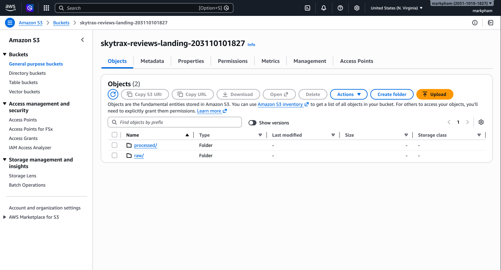
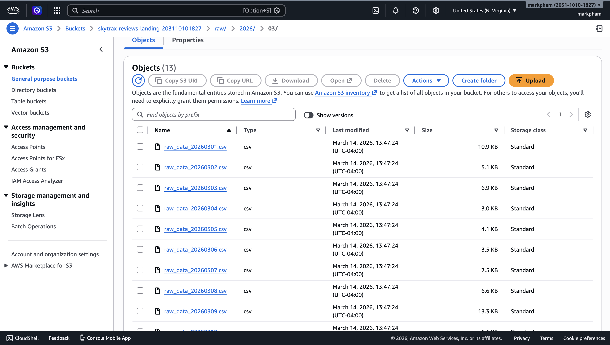
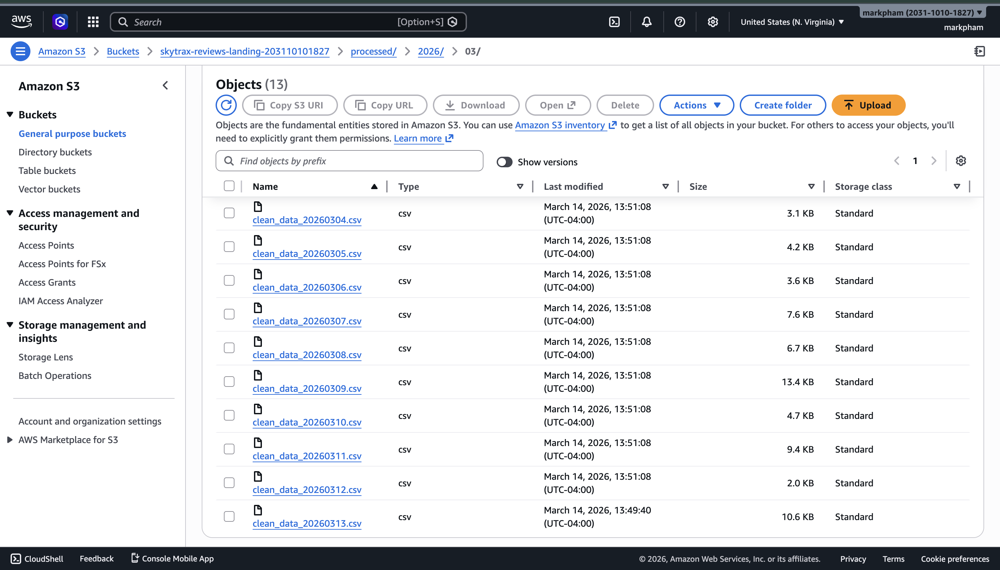

# Skytrax Reviews Extract-Load Pipeline (Part 1)


At Insurify, I work with Airflow, Terraform, and AWS every day. Two years ago, I signed up for an AWS account and accidentally racked up a $21,000 bill just from spinning up Amazon QuickSight — thankfully the Billing team sorted it out. That experience taught me how easy it is to get burned by cloud services if you don't understand what you're provisioning.

This project is my attempt to break down the tools I use at work into something anyone can follow. It's an EL pipeline that scrapes 160,000+ airline reviews from [AirlineQuality.com](https://www.airlinequality.com/), stages partitioned data to S3, and loads into Snowflake — with every piece of infrastructure defined in Terraform so you know exactly what you're spinning up (and what it costs).

- **26 parallel scraping tasks** (A-Z) with dynamic task mapping and dataset-driven DAG triggers
- **Infrastructure as Code** — S3 bucket (versioning, encryption, lifecycle policies), IAM roles/users with least-privilege access, Snowflake database/schema/table/S3 external stage — all managed with Terraform
- **Three-DAG pipeline** — crawl, process, load — chained via Airflow Datasets

## Architecture

```text
                    ┌──────────────────────────────┐
                    │   airlinequality.com         │
                    └──────────────┬───────────────┘
                                   │ scrape (26 A-Z tasks)
                                   ▼
                    ┌──────────────────────────────┐
                    │   S3: raw/YYYY/MM/           │
                    │   raw_data_YYYYMMDD.csv      │
                    └──────────────┬───────────────┘
                                   │ clean + transform
                                   ▼
                    ┌──────────────────────────────┐
                    │   S3: processed/YYYY/MM/     │
                    │   clean_data_YYYYMMDD.csv    │
                    └──────────────┬───────────────┘
                                   │ COPY INTO
                                   ▼
                    ┌──────────────────────────────┐
                    │   Snowflake                  │
                    │   SKYTRAX_REVIEWS_DB.RAW     │
                    │   .AIRLINE_REVIEWS           │
                    └──────────────────────────────┘
```

## Stack

| Layer | Technology |
| ----- | ---------- |
| Orchestrator | Apache Airflow (Astronomer Runtime, Docker) |
| Storage | AWS S3 (landing zone) → Snowflake |
| IaC | Terraform (AWS + Snowflake) |
| Language | Python 3.12, pandas, BeautifulSoup |

## S3 Bucket Structure

Data is date-partitioned by review date, organized into two prefixes:

```text
s3://skytrax-reviews-landing-<account-id>/
  raw/
    2024/
      01/
        raw_data_20240101.csv
        raw_data_20240102.csv
      02/
        raw_data_20240201.csv
    ...
  processed/
    2024/
      01/
        clean_data_20240101.csv
        clean_data_20240102.csv
    ...
```

The bucket contains two top-level prefixes — `raw/` for scraped data and `processed/` for cleaned data:



Raw CSVs are written directly by the scraper, one file per review date:



Processed CSVs are cleaned, transformed, and ready for Snowflake ingestion:



- **Versioning** enabled — protects against accidental overwrites
- **AES256 encryption** — server-side encryption on all objects
- **Lifecycle rules** — transitions to Standard-IA after 30 days, expires old versions after 90 days
- **Public access blocked** — all public access is denied at the bucket level

## Loading Strategy

**Incremental (daily)**: The `skytrax_crawl` DAG runs at 02:00 UTC, scrapes only yesterday's reviews, and uploads to S3. The downstream `skytrax_process` and `skytrax_snowflake` DAGs trigger automatically via Airflow Datasets — no cron, no polling. Each review date maps to exactly one CSV file, so re-runs are idempotent.

**Bulk backfill**: For the initial load, trigger `skytrax_crawl` with `full_scrape=True` to scrape all historical reviews (back to 2010). Snowflake's `COPY INTO` tracks which files have already been loaded, so re-running the bulk load is safe — no duplicates.

## DAGs

| DAG | Trigger | What it does |
| --- | ------- | ------------ |
| `skytrax_crawl` | Daily 02:00 UTC | Scrapes reviews, splits by date, uploads raw CSVs to S3 |
| `skytrax_process` | Dataset (raw) | Downloads raw CSVs, cleans/transforms, uploads processed CSVs |
| `skytrax_snowflake` | Dataset (processed) | Runs COPY INTO Snowflake for each review date |

## Getting Started

Follow these guides in order:

### 1. [Local Development](docs/local-dev.md)

Run the scraper and processing pipeline locally without any cloud services. Good for testing and development.

### 2. [Terraform & AWS Setup](docs/terraform.md)

Provision the S3 bucket, IAM role/user, and Snowflake resources with Terraform. Required before running the full pipeline.

### 3. [Airflow Setup](docs/airflow.md)

Configure Airflow connections, start the Astronomer environment, and run the full pipeline end-to-end.

### 4. [Snowflake](docs/snowflake.md)

Load data into Snowflake — both incremental (via DAG) and bulk backfill.

## Quick Reference

```bash
# Local smoke test (no AWS/Snowflake needed)
uv sync
STORAGE_MODE=local make scrape-smoke

# Run tests
make test

# Start Airflow
astro dev start

# Full infrastructure setup
cd terraform && terraform init && terraform apply
```

## Directory Layout

```text
dags/                  DAG definitions (no business logic)
include/
  tasks/
    extract/           Scraper → landing/raw/
    transform/         Cleaning pipeline → landing/processed/
    load/              S3 upload + Snowflake COPY INTO
  sql/                 SQL templates
terraform/             S3 bucket, IAM, Snowflake resources
tests/                 Unit tests
docs/                  Setup guides
landing/               Local data directory (CSVs gitignored)
```
