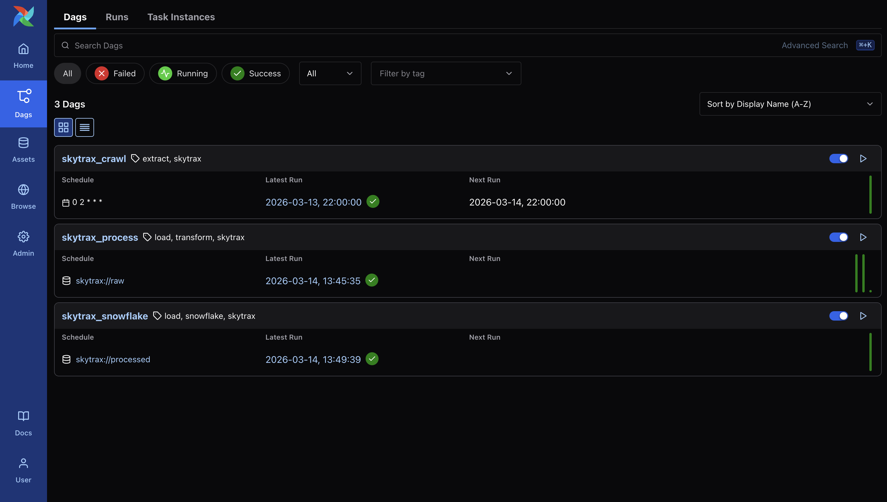
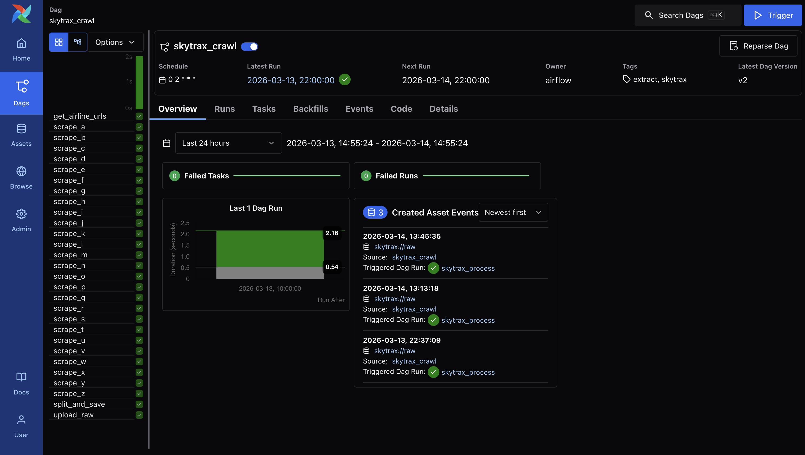
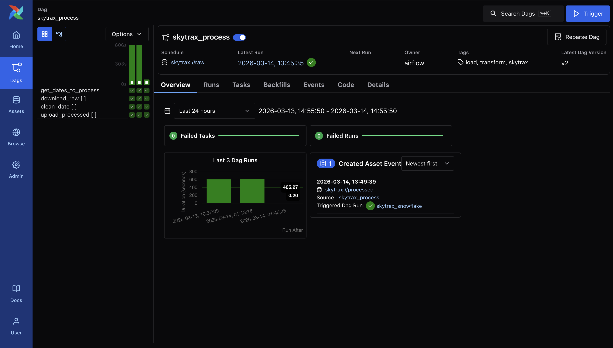
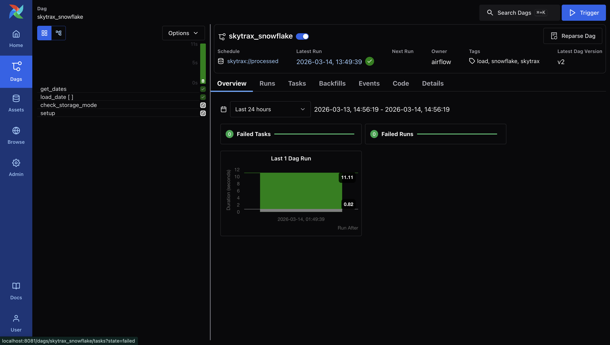

# Airflow Setup

Configure Airflow (Astronomer) to run the full pipeline with S3 and Snowflake.

## Prerequisites

- [Astro CLI](https://www.astronomer.io/docs/astro/cli/install-cli)
- Docker Desktop running
- Terraform setup completed ([docs/terraform.md](terraform.md))

## Step 1: First-time build

Build the Astronomer Docker image:

```bash
make dev-setup
```

If port 8080 is taken:

```bash
make dev-setup PORT=8081
```

## Step 2: Create the `.env` file

Create a `.env` file in the project root (this file is gitignored):

```bash
STORAGE_MODE=s3
S3_BUCKET=<your-bucket-name>
AIRFLOW_CONN_AWS_S3_CONNECTION=aws://<ACCESS_KEY_ID>:<URL_ENCODED_SECRET>@/?region_name=us-east-1
AIRFLOW_CONN_SNOWFLAKE_DEFAULT='{"conn_type":"snowflake","login":"<SNOWFLAKE_USER>","password":"<SNOWFLAKE_PASSWORD>","schema":"RAW","extra":{"account":"<ORG>-<ACCOUNT>","database":"SKYTRAX_REVIEWS_DB","warehouse":"COMPUTE_WH","role":"SYSADMIN"}}'
```

### Where to get the values

| Variable | How to get it |
| -------- | ------------- |
| `S3_BUCKET` | `cd terraform && terraform output bucket_name` |
| `ACCESS_KEY_ID` | `cd terraform && terraform output airflow_access_key_id` |
| `URL_ENCODED_SECRET` | `cd terraform && terraform output -raw airflow_secret_access_key` — then URL-encode special characters (see below) |
| `SNOWFLAKE_USER` | Your Snowflake username |
| `SNOWFLAKE_PASSWORD` | Your Snowflake password |
| `ORG-ACCOUNT` | Your Snowflake account identifier (e.g., `nvnjoib-on80344`) |

### URL-encoding the AWS secret key

If your secret key contains special characters, URL-encode them:

| Character | Encoded |
| --------- | ------- |
| `+` | `%2B` |
| `/` | `%2F` |
| `=` | `%3D` |
| `@` | `%40` |

Example:

```text
# Original:  GSstxwFTvbwTIvIczSpGZLv810qLwLG+EpaVi5St
# Encoded:   GSstxwFTvbwTIvIczSpGZLv810qLwLG%2BEpaVi5St
```

## Step 3: Start Airflow

```bash
astro dev start
```

The Airflow UI is available at `http://localhost:8080` (or your configured port).

## DAGs Overview

The pipeline consists of three DAGs that are chained together via Airflow Datasets:



### `skytrax_crawl` — Extract

Runs daily at 02:00 UTC. Scrapes airline reviews from airlinequality.com using 26 parallel tasks (one per letter A-Z), splits reviews by date, and uploads raw CSVs to S3. On completion, it emits the `skytrax://raw` dataset to trigger the next DAG.



### `skytrax_process` — Transform

Triggered automatically when `skytrax_crawl` emits new raw data. For each review date, it downloads the raw CSV, runs the cleaning/transformation pipeline, and uploads the processed CSV to S3. Emits the `skytrax://processed` dataset when done.



### `skytrax_snowflake` — Load

Triggered automatically when `skytrax_process` emits processed data. Runs `COPY INTO` for each review date to load the cleaned CSVs from the S3 external stage into Snowflake.



## Step 4: Run the pipeline

### Daily incremental run

The `skytrax_crawl` DAG runs daily at 02:00 UTC. It scrapes yesterday's reviews, uploads to S3, and triggers the downstream DAGs via Datasets.

To trigger manually: click the play button on `skytrax_crawl` in the Airflow UI.

### Full initial load

For the first run, you need to scrape all historical reviews:

1. Go to the `skytrax_crawl` DAG in the Airflow UI
1. Click **Trigger DAG w/ config**
1. Set `full_scrape` to `true`
1. Click **Trigger**

This produces hundreds of raw CSVs going back to 2010. The downstream `skytrax_process` and `skytrax_snowflake` DAGs trigger automatically.

## Step 5: Verify

Check S3 for uploaded files:

```bash
aws s3 ls s3://<your-bucket-name>/raw/ --recursive | head -20
aws s3 ls s3://<your-bucket-name>/processed/ --recursive | head -20
```

Check Snowflake for loaded data:

```sql
SELECT COUNT(*) FROM SKYTRAX_REVIEWS_DB.RAW.AIRLINE_REVIEWS;
```

## Restarting Airflow

After changing `.env` or `requirements.txt`:

```bash
astro dev restart
```

## Troubleshooting

### "No module named airflow.providers.amazon"

The Amazon provider is missing from the Docker image. Make sure `requirements.txt` includes:

```text
apache-airflow-providers-amazon>=8.0.0
```

Then restart: `astro dev restart`

### SignatureDoesNotMatch on S3 uploads

Your AWS secret key likely contains `+` or other special characters that weren't URL-encoded in the connection URI. Double-check the encoding in `.env`.

### Snowflake "account not specified"

The Snowflake connection must use JSON format (not URI format) in `.env`. Make sure `AIRFLOW_CONN_SNOWFLAKE_DEFAULT` is wrapped in single quotes and uses the JSON structure shown above.

## Next step

To bulk-load historical data into Snowflake, see [docs/snowflake.md](snowflake.md).
