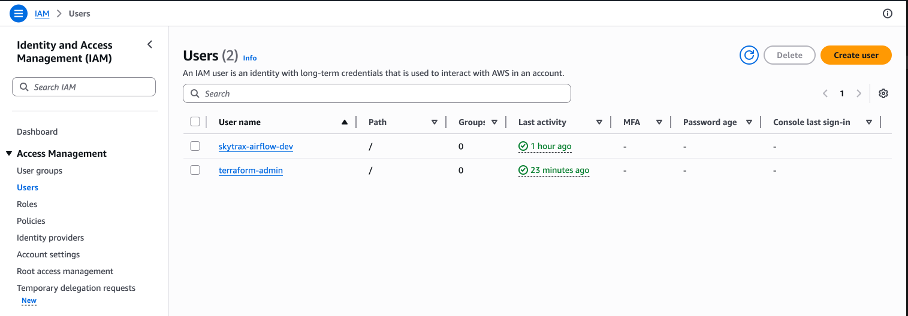
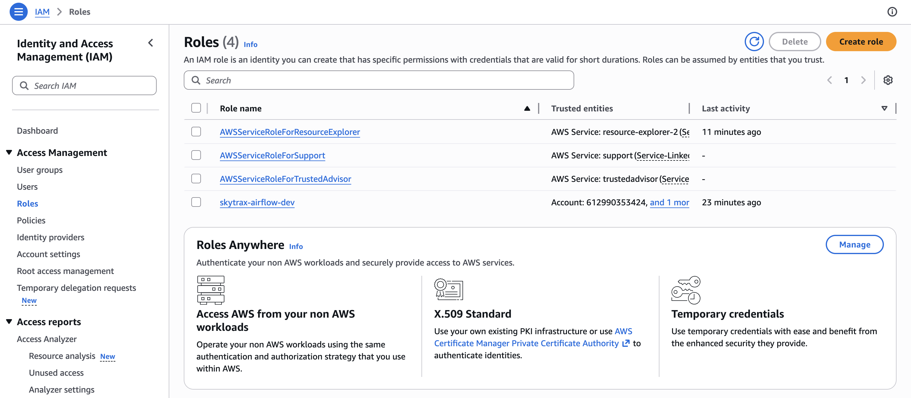

# Terraform Setup

Provision the AWS and Snowflake infrastructure from scratch. This guide assumes you've never used AWS CLI or Terraform before.

## Prerequisites

Install these tools first:

1. **AWS CLI** — [Install guide](https://docs.aws.amazon.com/cli/latest/userguide/getting-started-install.html)

   ```bash
   # macOS (Homebrew)
   brew install awscli

   # Verify
   aws --version
   ```

1. **Terraform >= 1.6** — [Install guide](https://developer.hashicorp.com/terraform/install)

   ```bash
   # macOS (Homebrew)
   brew tap hashicorp/tap
   brew install hashicorp/tap/terraform

   # Verify
   terraform --version
   ```

1. **An AWS account** — [Sign up](https://aws.amazon.com/free/) if you don't have one

1. **A Snowflake account** — [Free trial](https://signup.snowflake.com/) works

## Step 1: Create an AWS root access key (first-time setup)

If you've never used the AWS CLI before, you need credentials to authenticate.

1. Log in to the [AWS Console](https://console.aws.amazon.com/)
1. Click your account name (top-right) → **Security credentials**
1. Scroll to **Access keys** → **Create access key**
1. Select **Command Line Interface (CLI)**, check the confirmation box, click **Next**
1. Click **Create access key**
1. Copy the **Access key ID** and **Secret access key** (you won't see the secret again)

> **Note**: These are root account keys. We'll create a dedicated Terraform user in the next steps and can delete these root keys afterward.

## Step 2: Configure the AWS CLI

```bash
aws configure
```

Enter:

| Prompt | Value |
| ------ | ----- |
| AWS Access Key ID | The access key from Step 1 |
| AWS Secret Access Key | The secret key from Step 1 |
| Default region name | `us-east-1` |
| Default output format | `json` |

Verify it works:

```bash
aws sts get-caller-identity
```

You should see your account ID and ARN.

## Step 3: Create a Terraform admin IAM user

Don't use root credentials long-term. Create a dedicated IAM user for Terraform:

```bash
# Create the user
aws iam create-user --user-name terraform-admin

# Attach admin policy (scope down for prod)
aws iam attach-user-policy \
  --user-name terraform-admin \
  --policy-arn arn:aws:iam::aws:policy/AdministratorAccess

# Create access keys for this user
aws iam create-access-key --user-name terraform-admin
```

Save the `AccessKeyId` and `SecretAccessKey` from the output.

## Step 4: Configure the Terraform CLI profile

```bash
aws configure --profile terraform-admin
```

| Prompt | Value |
| ------ | ----- |
| AWS Access Key ID | The key from Step 3 |
| AWS Secret Access Key | The secret from Step 3 |
| Default region name | `us-east-1` |
| Default output format | `json` |

Terraform uses `profile = "terraform-admin"` in `main.tf`, so it picks up this profile automatically.

> **Optional cleanup**: Now that `terraform-admin` is set up, you can delete the root access keys from Step 1 in the AWS Console under **Security credentials > Access keys**.

## Step 5: Find your AWS account ID

You'll need this for the S3 bucket name:

```bash
aws sts get-caller-identity --profile terraform-admin --query Account --output text
```

## Step 6: Set your variables

Create `terraform/terraform.tfvars` (this file is gitignored):

```hcl
bucket_name       = "skytrax-reviews-landing-<YOUR_AWS_ACCOUNT_ID>"
snowflake_org     = "<YOUR_SNOWFLAKE_ORG>"
snowflake_account = "<YOUR_SNOWFLAKE_ACCOUNT>"
snowflake_user    = "<YOUR_SNOWFLAKE_USERNAME>"
```

**Where to find Snowflake values**: Log in to the Snowflake UI → **Admin > Accounts**. Your account identifier is `ORG-ACCOUNT` (e.g., `nvnjoib-on80344`). Use the org part for `snowflake_org` and the account part for `snowflake_account`.

Optional overrides (defaults are fine for dev):

```hcl
aws_region   = "us-east-1"    # default
environment  = "dev"           # default
```

## Step 7: Set the Snowflake password

Terraform reads the Snowflake password from an environment variable (never stored in files):

```bash
export SNOWFLAKE_PASSWORD=<your-snowflake-password>
```

## Step 8: Initialize Terraform

```bash
cd terraform
terraform init
```

This downloads the AWS and Snowflake provider plugins. You only need to run this once (or after changing providers).

## Step 9: Preview and apply

```bash
# See what will be created
terraform plan

# Create everything
terraform apply
```

Type `yes` when prompted. This takes about 30 seconds.

## What gets created

### AWS resources

| Resource | Purpose |
| -------- | ------- |
| S3 bucket | Landing zone for raw + processed CSVs |
| Bucket versioning | Protects against accidental overwrites |
| Bucket encryption | AES256 server-side encryption |
| Public access block | Prevents accidental public exposure |
| Lifecycle rules | Transitions to Standard-IA after 30 days, expires old versions after 90 days |
| IAM role `skytrax-airflow-dev` | S3-scoped role (also used by Snowflake to read from S3) |
| IAM user `skytrax-airflow-dev` | Programmatic access for Airflow with direct S3 policy |
| Access key | Credentials for the Airflow IAM user |

| IAM Users | IAM Roles |
| --------- | --------- |
|  |  |

### Snowflake resources

| Resource | Purpose |
| -------- | ------- |
| Database `SKYTRAX_REVIEWS_DB` | Top-level container |
| Schema `RAW` | Schema for raw/processed data |
| Table `AIRLINE_REVIEWS` | 25-column table matching the processed CSV layout |
| Stage `SKYTRAX_S3_STAGE` | S3 external stage pointing to the bucket, using the IAM role |

## Step 10: Retrieve Airflow credentials

After `terraform apply`, get the access key for your `.env`:

```bash
terraform output airflow_access_key_id
terraform output -raw airflow_secret_access_key
```

Save these — you'll need them when configuring Airflow ([docs/airflow.md](airflow.md)).

## Step 11: Update the IAM trust policy for Snowflake

After creating the Snowflake stage, Snowflake assigns an AWS IAM user that needs permission to assume your IAM role. To find it:

1. In the Snowflake UI, run:

   ```sql
   DESC STAGE SKYTRAX_REVIEWS_DB.RAW.SKYTRAX_S3_STAGE;
   ```

1. Find the `SNOWFLAKE_IAM_USER` row and copy the `AWS_IAM_USER_ARN` value (e.g., `arn:aws:iam::612990353424:user/651j1000-s`)

1. Open `terraform/iam_airflow.tf` and add the ARN to the trust policy:

   ```hcl
   principals {
     type        = "AWS"
     identifiers = [
       "arn:aws:iam::<YOUR_ACCOUNT_ID>:root",
       "<SNOWFLAKE_AWS_IAM_USER_ARN>",  # from DESC STAGE
     ]
   }
   ```

1. Apply the change:

   ```bash
   terraform apply
   ```

## File overview

```text
terraform/
  main.tf              Provider config + S3 bucket
  iam_airflow.tf       IAM role, user, access key, S3 policy
  snowflake.tf         Snowflake database, schema, table, S3 stage
  variables.tf         Input variables
  outputs.tf           Outputs (bucket name, role ARN, access keys, Snowflake names)
  terraform.tfvars     Your variable values (gitignored)
```

## Next step

Configure Airflow to use these credentials: [docs/airflow.md](airflow.md).
